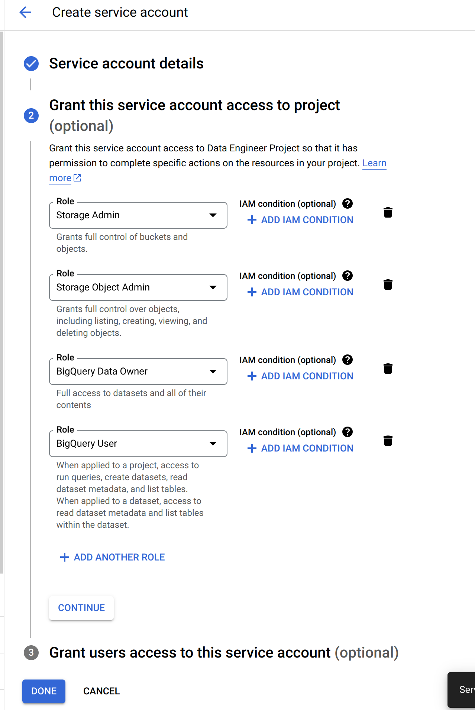

# Tổng quan

## Hướng dẫn Setup môi trường
1. Khởi tạo GCP project
    
Tại màn hình console của GCP, chọn hoặc tạo project mới.

Điền tên project sau đó chọn `Create`.

Tại màn hình console chính, nhấn vào biểu tượng `Navigation menu` -> `Billing` -> `Link a billing account` để liên kết tài khoản thanh toán với project.

   
2. Enable các API Services cần thiết

Nhấn vào biểu tượng `Navigation menu` -> `APIs & Services` -> `Enable APIs and Services`.
Chọn `ENABLE APIS AND SERVICES`, tìm kiếm và `ENABLE` các API sau:
   - Google Drive API
   - Compute Engine API

3. Tạo Service Account và tải file json key

Service Account là một loại tài khoản đặc biệt của Google, không đại diện cho bất cứ người dùng cụ thể nào. Service Account được sử dụng để thực hiện xác thực và phân quyền cho các ứng dụng cần truy cập vào tài nguyên của GCP. Cùng với cơ chế Role-based Access Congtrol (Kiểm soát truy cập dựa trên vai trò), mỗi Role tương ứng với một tập hợp các quyền (permissrions) cho phép thực hiện các thao tác lên tài nguyên GCP. Mỗi Service Account có thể được gán một hoặc nhiều Role, và mỗi Role có thể được gán cho một hoặc nhiều Service Account. Các Role được gán cho một Service Account sẽ xác định các quyền mà Service Account đó có thể thực hiện trên các tài nguyên của GCP.
   
Để tạo Service Account, nhấn vào biểu tượng `Navigation menu` -> `IAM & Admin` -> `Service Accounts` -> `Create Service Account`.

Điền tên Service Account, chọn `CREATE AND CONTINUE`.
Lần lượt tìm và chọn các Role sau:
   - Cloud Storage -> Storage Admin
   - Big Query -> BigQuery Data Owner
   - Big Query - > BigQuery User

Chọn `DONE` để hoàn tất tạo Service Account.

Tại màn hình `Service Accounts`, tìm tới Service Account vừa tạo,  nhấn vào biểu tượng `Actions` -> `Manage keys`.

Chọn `ADD KEY` -> `Create new key` -> `JSON` -> `CREATE` để tạo file json key và tải về máy.

4. Tạo Google Cloud Storage Bucket

Nhấn vào biểu tượng `Navigation menu` -> `Cloud Storage` -> `Buckets` -> `Create`.

Điền tên bucket và nhấn `CONTINUE`.

Chọn như hình dưới và nhấn `CREATE`.

Cửa sổ Confirm `Public access will be prevented` sẽ hiện ra, chọn `CONFIRM` để xác nhận chặn truy cập public và hoàn tất tạo bucket.

Default Storage Class và Location có thể chọn theo nhu cầu sử dụng.
Trong đó Storage Class là metadata của object, xác định cách lưu trữ và giá cả của object. Location là vị trí lưu trữ của object, ảnh hưởng đến tốc độ truy cập và giá cả.
Có 4 loại Storage Class:
   - **Standard**: Lưu trữ dữ liệu trên nhiều thiết bị và nhiều vị trí, đảm bảo độ tin cậy và khả năng khôi phục dữ liệu cao nhất. Giá cả cao nhất.
   - **Nearline**: Dành cho dữ liệu ít truy cập, giá cả thấp hơn Standard nhưng phí truy cập cao hơn.
   - **Coldline**: Dành cho dữ liệu ít truy cập, giá cả thấp nhất nhưng phí truy cập cao nhất.
   - **Archive**: Dành cho dữ liệu ít truy cập, giá cả thấp nhất nhưng phí truy cập cao nhất, thời gian truy cập dữ liệu lâu nhất.

Để giúp tối ưu chi phí lưu trữ, Goole cung cấp cơ chế Object Lifecycle Management giúp tự động chuyển đổi giữa các loại Storage Class dựa trên các Rule xác định.

Trong dự án này, dữ liệu được download từ Google Drive lưu trữ trên Cloud Storage Bucket hàng ngày, sau đó dữ liệu được insert vào BigQuery để phục vụ nhu cầu phân tích. 
Để tối ưu chi phí lưu trữ trong dự án này, ta sẽ sử dụng thiết lập các Rule như sau:
- Dữ liệu được download từ GG Drive sau đó ngay lập tức được insert vào BigQuery -> Default Storage Class: Standard
- Dữ liệu được insert vào BigQuery sẽ không còn cần lưu trữ trên Cloud Storage, tuy nhiên để tránh trường hợp quá trình insert từ GCS -> BigQuery gặp lỗi dẫn tới phải download lại dữ liệu từ GG Drive, ta sẽ lưu trữ dữ liệu trên GCS trong 7 ngày sau đó tự động xóa object khỏi GCS -> Rule: 7 ngày sau khi object được tạo, xóa object.

Tùy thuộc vào các yêu cầu cụ thể cũng như mục tiêu sử dụng, tần suất truy cập và kích thước dữ liệu, ta có thể lựa chọn Storage Class và thiết lập Rule phù hợp một cách linh hoạt.

Để thiết lập Object Lifecycle Management, nhấn vào bucket vừa tạo, chọn `Lifecycle` -> `Add A rule`.

Điền thông tin Rule như hình dưới và nhấn `CREATE`.

5. Setup Airflow trên GCP Compute Engine

